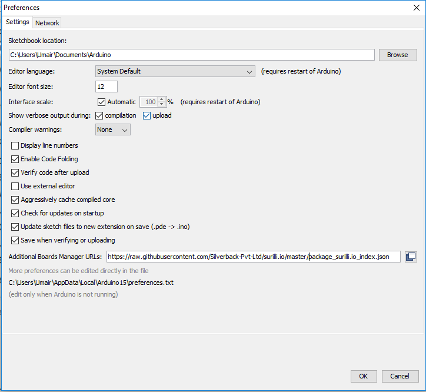
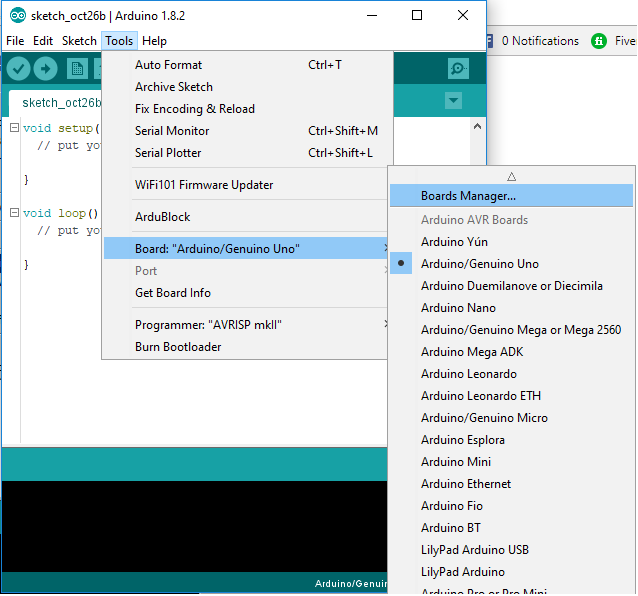
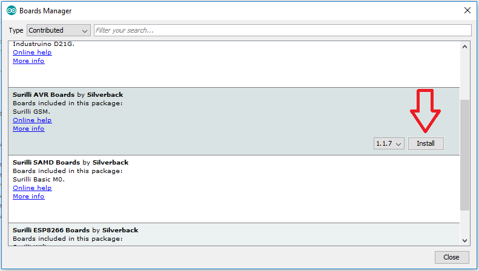
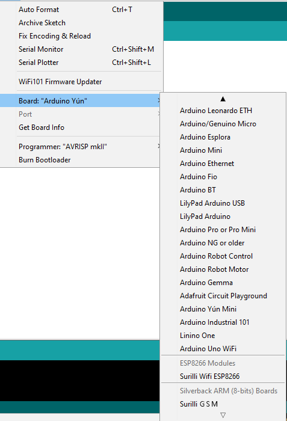
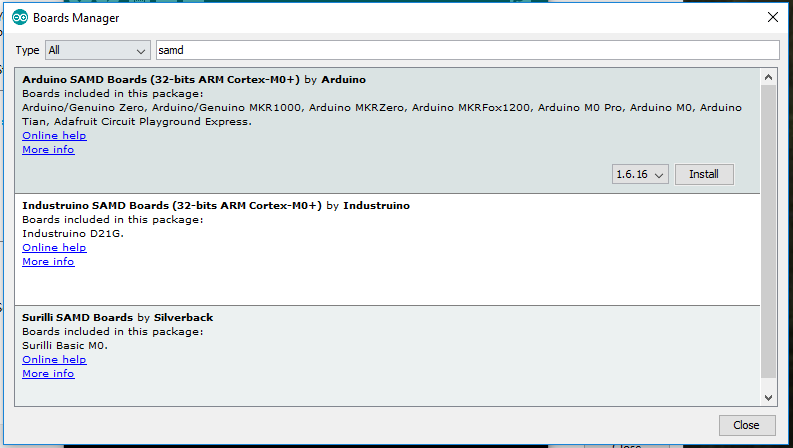
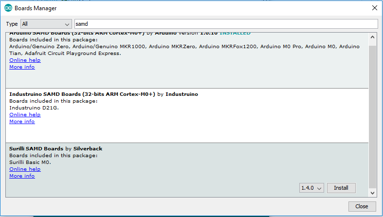
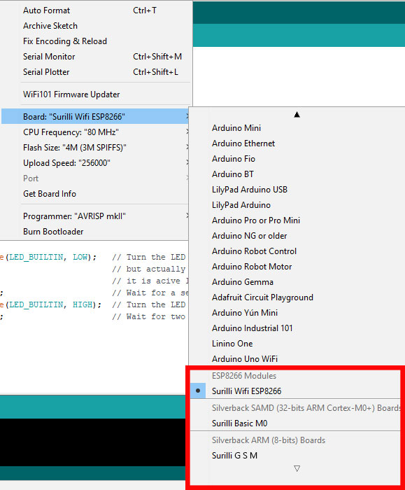
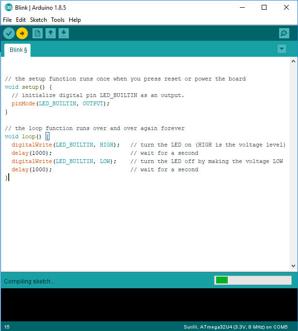

# Silverback Arduino Boards

This repository contains support for the following Silverback Arduino-compatible development boards.

**IMPORTANT NOTE:** These board files have been updated for compatibility with Arduino version 1.8 and higher. Some boards (e.g. SAMD) may not compile correctly with earlier versions of Arduino. If you need compatibility with earlier versions of Arduino, you can choose previous releases of these boards from the Boards Manager.

#### AVR Boards

* [Surilli GSM (32u4)](https://www.surilli.io)

#### SAMD (ARM Cortex-M0+) Boards

* [Surilli SAMD (SAMD21)](https://www.surilli.io)

#### ESP8266 Boards

* [Surilli WiFi (ESP8266)](https://www.surilli.io)

### Installation Instructions

To add board support for our products, start Arduino and open the Preferences window (**File** > **Preferences**). Now copy and paste the following URL into the 'Additional Boards Manager URLs' input field:

	https://raw.githubusercontent.com/Silverback-Pvt-Ltd/surilli.io/master/package_surilli.io_index.json

If there is already an URL from another manufacturer in that field, click the button at the right end of the field. This will open an editing window allowing you to paste the above URL onto a new line.

### AVR and ESP Installation Instructions

Open the Boards Manager window by selecting **Tools** > **Board**, scroll to the top of the board list, and select **Boards Manager**.

If you type "surilli" (without quotes) into search field, you will see options to install Silverback's AVR and ESP boards. Click the "Install" button that appears. 

Once installed, the boards will appear at the bottom of the board list.

### SAMD Installation Instructions

When installing SAMD boards, you will need to first install Arduino SAMD support, then Silverback's SAMD boards.

Open the Boards Manager window by selecting **Tools** > **Board**, scroll to the top of the board list, and select **Boards Manager**. Now type "samd" (without quotes) into the "filter box". Two entries should show up, one for Arduino SAMD boards, and one for Silverback SAMD boards. We'll install both of these, starting with Arduino SAMD boards.

Click anywhere in the "Arduino SAMD Boards" box, and click "Install". This is a large installation and will take a while.

Now click anywhere in the "Silverback SAMD Boards" box, and click "Install". This is a small installation and will happen much faster.

You're now ready to use Silverback SAMD boards. They will appear at the bottom of the board list.

 Upload the Blinky code
 
 
 
**Have fun!** 
